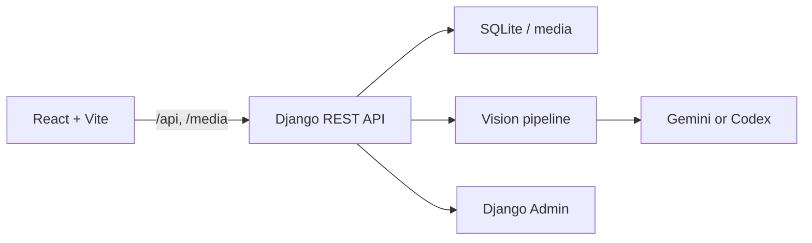

# 꿀템

상품 추천이 여러 SNS와 쇼핑몰에 흩어지는 문제를 해결하기 위해 만든
커뮤니티형 추천 서비스입니다. 사용자가 쇼핑 화면을 캡처해 올리면 AI가
상품 정보를 추출하고, 다른 사용자의 추천·리뷰·반응을 모아 믿을 만한
아이템을 탐색할 수 있습니다.

<p align="center">
  
  
</p>

## 핵심 사용자 흐름

1. 상품 URL과 쇼핑 화면 screenshot을 업로드합니다.
2. vision pipeline이 상품명, 가격, 브랜드, 카테고리와 대표 이미지를
   추출합니다.
3. URL 정규화와 상품명·브랜드·모델명 비교로 중복 후보를 먼저 보여줍니다.
4. 사용자가 기존 상품 또는 새 상품을 선택하고 추천 이유와 리뷰를
   작성합니다.
5. 추천 수와 리뷰 반응을 바탕으로 ranking과 상세 페이지가 갱신됩니다.

## 주요 기능

- JWT 기반 회원가입·로그인·로그아웃
- Gemini 또는 Codex vision provider를 이용한 screenshot 정보 추출
- 상품 영역 crop 및 미디어 저장
- URL, 상품명, 브랜드, model token을 조합한 중복 후보 탐색
- 카테고리별 상품 ranking과 추천 toggle
- 리뷰·댓글 작성 및 좋아요/싫어요 반응
- 사용자 profile, 팔로우·팔로워, 추천 상품 모아보기
- 일반 사용자의 상품 수정·삭제 요청과 Django admin 승인 workflow

## 시스템 구조



개발 환경에서는 Vite가 `/api`와 `/media`를 Django로 proxy합니다.
배포 환경에서는 Nginx가 정적 frontend를 제공하고 API 요청을 Gunicorn에
전달하도록 구성했습니다.

## 기술 스택

| 영역 | 기술 |
|---|---|
| Frontend | React 19, Vite, React Router, Axios |
| Backend | Python, Django 4.2, Django REST Framework |
| Auth | Simple JWT |
| Vision | Gemini API 또는 Codex CLI, Pillow |
| Data | SQLite, Django ORM, media file storage |
| Deploy | Nginx, Gunicorn |
| Quality | Django TestCase, Oxlint, Vite production build |

## 로컬 실행

요구 사항은 Python 3.10+, Node.js 20+, npm입니다.

### Backend

```bash
cd backend
python -m venv venv
source venv/bin/activate
pip install -r requirements.txt
python manage.py migrate
python manage.py runserver
```

API는 기본적으로 `http://127.0.0.1:8000/api/`에서 실행됩니다. vision
기능을 사용하려면 [vision/README.md](vision/README.md)에 따라 provider와
API key를 별도로 설정하세요.

### Frontend

```bash
cd frontend
npm install
npm run dev
```

Frontend는 기본적으로 `http://127.0.0.1:5175`에서 실행됩니다.
세부 환경변수와 production build는
[frontend/README.md](frontend/README.md) 및
[backend/README.md](backend/README.md)를 참고하세요.

## 데이터 모델


핵심 관계는 `User → Item → Review → Comment`이며, 상품·리뷰·댓글 반응은
사용자별 unique constraint로 중복 투표를 막습니다. 상품 변경 요청은 원본
데이터와 분리해 승인 전까지 실제 상품을 수정하지 않습니다.

## 설계에서 해결한 문제

### AI 추출 결과를 바로 신뢰하지 않기

vision 결과에 confidence와 warning을 포함하고, 사용자가 검토한 뒤
등록하도록 구성했습니다. provider 오류와 quota 오류도 API에서 구분해
재시도 가능 여부를 전달합니다.

### 중복 상품을 자동 병합하지 않기

URL exact match와 이름·브랜드·model token 점수로 후보만 제시합니다.
유사도만으로 기존 데이터를 덮어쓰지 않고 최종 선택을 사용자에게
남겼습니다.

### 커뮤니티 데이터의 수정 권한 분리

일반 사용자는 상품을 직접 덮어쓰거나 삭제하지 않고 변경 요청을 생성합니다.
관리자는 Django admin에서 요청을 승인하거나 거절해 audit 가능한 흐름을
유지합니다.

## 팀과 기여

박채훈([@chek737](https://github.com/chek737)), 이서영
([@sksy930](https://github.com/sksy930)), 최재윤
([@Jaeyun-18](https://github.com/Jaeyun-18))이 함께 개발했습니다.

박채훈은 다음 영역에 집중했습니다.

- frontend·backend·AI 분석 흐름의 통합
- vision 결과를 수정할 수 있는 반자동 등록과 중복 처리
- ranking·review·사용자 기능을 하나의 상품 data model에 연결
- Nginx·Gunicorn 기반 배포 환경 구성

## 검증

```bash
cd backend
python manage.py test

cd ../frontend
npm run lint
npm run build
```

## 현재 상태

KAIST MadCamp 공통과제로 제작한 MVP입니다. 과거 demo domain은 현재 DNS가
해제되어 저장소의 screenshot과 로컬 실행을 기준으로 확인할 수 있습니다.
